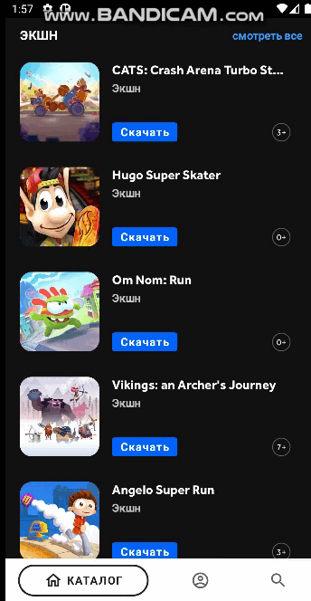

# Gamersbase Mobile Lite version

## Просмотр каталога игр

## Поиск игр

## Technologies
- [Kotlin](https://kotlinlang.org)
- [Gradle Kotlin DSL](https://docs.gradle.org/current/userguide/kotlin_dsl.html)
- [Kotlin Coroutines](https://kotlinlang.org/docs/coroutines-overview.html)
- [OkHttp](https://square.github.io/okhttp) + [Retrofit](https://square.github.io/retrofit)
- [kotlinx.serialization](https://github.com/Kotlin/kotlinx.serialization)
- [Android Jetpack](https://d.android.com/jetpack)
- [Jetpack Compose](https://d.android.com/jetpack/compose)
- [Google Dagger(Dagger 2)](https://dagger.dev)
- MVVM
- Multi module Architecture